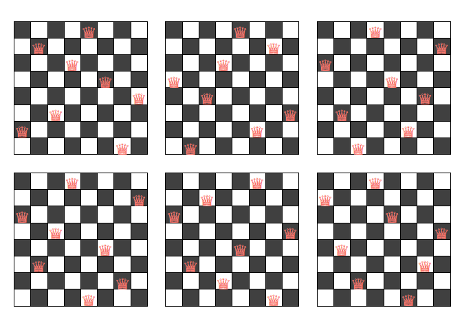
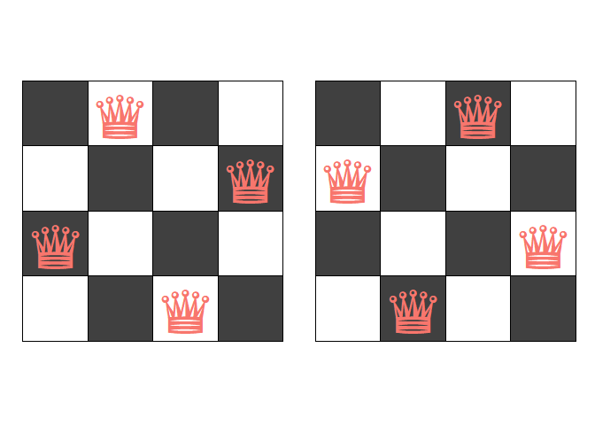

This repository is created to store some simple functions related to
board games.

Currently, it contains the following functions poscount and queenchess.

1.  poscount: Counts the total number of possible placements of n queens
    on an nxn chessboard given that no queen can attack the other in one
    turn. This function can also return the list of all possible
    layouts.

2.  poscountiter: Counts the total number of possible placements of n
    queens on an nxn chessboard given that no queen can attack the other
    in one turn in an iterative manner rather than using recursion. This
    function can also return the list of all possible layouts.

3.  queenchess: This function plots the possible placements of queens on
    a chessboard. Maximum number of boards that can be displayed is
    bounded above by 20 as the default.

Below we can see some examples of the outputs. First. we count all
possible layouts for 8x8 and 10x10 chessboards. Then we plot some
possible layouts.

    source("count_the_number_of_placements_of_queens.R")
    cat("The number of possible layouts for an 8x8 and a 10x10 chessboard are ", poscount(n = 8)$s, " and ", poscount(n = 10)$s, '.\n', sep = '')

    ## The number of possible layouts for an 8x8 and a 10x10 chessboard are 92 and 724.

Below we can see two example plots. The size of the queen can be
adjusted depending on plot size.

    plot(queenchess(poscount(n = 8, givelayout = TRUE)$qlays, maxboard = 6, tsize = 8))

    plot(queenchess(poscount(n = 5, givelayout = TRUE)$qlays, tsize = 6))

    plot(queenchess(poscount(n = 4, givelayout = TRUE)$qlays))

